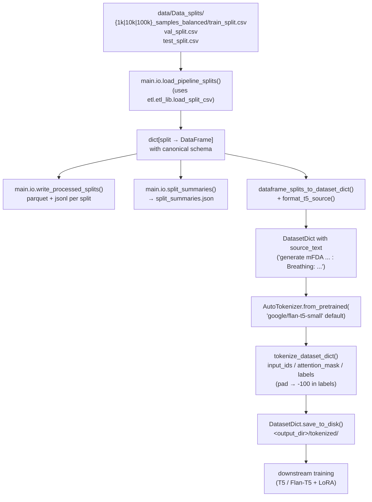
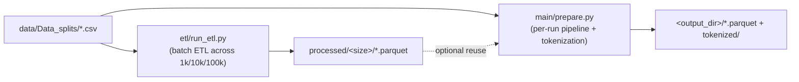

# Data pipeline — canonical splits → T5-ready batches

The data pipeline (package [`main/`](../main)) is the layer between ETL and
training. It loads the canonical splits produced by ETL (or directly from the
raw CSVs via the same `etl` helpers), wraps them in a stable T5-style prompt,
and optionally tokenizes everything into a Hugging Face `DatasetDict` saved to
disk for fast reuse during training.

| module | role |
| --- | --- |
| `main/paths.py` | `repo_root()`, `data_splits_dir()` |
| `main/io.py` | `load_pipeline_splits()`, `write_processed_splits()`, `split_summaries()` |
| `main/prompts.py` | `DEFAULT_TASK_PREFIX`, `format_t5_source()` |
| `main/tokenization.py` | `dataframe_splits_to_dataset_dict()`, `tokenize_dataset_dict()` |
| `main/prepare.py` | CLI entry point (`python -m main.prepare ...`) |

## High-level flow



## Stage details

### 1. Load canonical splits — `main/io.py`
`load_pipeline_splits(root, train_size)` builds three `LoadSpec`s pointing at
the chosen synthetic train, the synthetic `val_split.csv`, and the real
`test_split.csv`, then delegates to `etl.etl_lib.load_split_csv` so the in-
memory frames already have the canonical schema (parsed features, `input_text`,
`target_text`, `example_hash`, …). This guarantees the pipeline never sees raw
strings without going through the same parser/dedup as ETL.

### 2. Serialize — `write_processed_splits()` + `split_summaries()`
Wraps `etl.etl_lib.write_outputs` for each split (parquet + JSONL, CSV
fallback) and writes a `split_summaries.json` capturing row counts, group
counts, parse-failure counts, and char-length percentiles. The CLI logs each
step:

```
[prepare] train -> 100,000 rows
[prepare] val   ->  10,000 rows
[prepare] test  ->      96 rows
```

### 3. Format T5 prompt — `main/prompts.py`
`format_t5_source` prepends a stable instruction prefix:

```
generate mFDA clinical speech report from acoustic biomarkers: Breathing: 78 Lips: 1.75 Palate: 0.94 ...
```

`source_text` is added to each `Dataset` while keeping the raw `input_text` for
debugging.

### 4. Tokenize — `main/tokenization.py`
`tokenize_dataset_dict` runs `AutoTokenizer` over `source_text` /
`target_text` with truncation + padding to `max_source_length` /
`max_target_length`, then **rewrites pad ids in labels to `-100`** so the
HuggingFace seq2seq loss ignores padding. Selected metadata columns
(`sample_id`, `split`, `is_real`, `group`, `example_hash`) are passed through
unchanged for traceability.

### 5. Save — `DatasetDict.save_to_disk()`
The tokenized `DatasetDict` is written to `<output_dir>/tokenized/` and can be
loaded later with `datasets.load_from_disk(...)` to feed
`Seq2SeqTrainer` / a custom training loop.

## CLI

All commands assume PowerShell on Windows and that you start from the repo
root:

```powershell
cd c:\Users\dawoo\PycharmProjects\AcousticDrivenGeneration
```

### 0. One-time environment setup

```powershell
# create the conda env (Python 3.11 recommended)
conda create -n AcousticDrivenGeneration python=3.11 -y
conda activate AcousticDrivenGeneration

# project Python deps (pandas, pyarrow, datasets, transformers, ...)
pip install -r requirements.txt
```

For later sessions just activate the env:

```powershell
conda activate AcousticDrivenGeneration
```

Sanity check that `python` resolves to the env interpreter:

```powershell
python -c "import sys; print(sys.executable)"
# -> ...\envs\AcousticDrivenGeneration\python.exe
```

### 1. Prepare splits (parquet + jsonl + summaries)

```powershell
# small smoke run
python -m main.prepare --output-dir data\processed\1k --train-size 1k

# medium / full
python -m main.prepare --output-dir data\processed\10k  --train-size 10k
python -m main.prepare --output-dir data\processed\100k --train-size 100k
```

Expected output:

```
[prepare] repo_root        = C:\Users\dawoo\PycharmProjects\AcousticDrivenGeneration
[prepare] train_size       = 1k
[prepare] output_dir       = ...\data\processed\1k
[prepare] loading splits via etl ...
[prepare]   train ->   1,000 rows
[prepare]   val   ->  10,000 rows
[prepare]   test  ->      96 rows
[prepare] writing parquet/jsonl ...
[prepare] wrote summaries  -> ...\split_summaries.json
[prepare] done.
```

### 2. Also tokenize for T5 / Flan-T5

```powershell
python -m main.prepare --output-dir data\processed\100k --train-size 100k --tokenize --tokenizer-model google/flan-t5-small --save-tokenized-dir data\processed\100k\tokenized
```

Other tokenizer ids work the same way, e.g.
`--tokenizer-model google/flan-t5-base` or `google-t5/t5-small`.

Use the **same** hub id (or the same **size tier** for T5 vs Flan-T5) as **`--model-name`** in [`main/train.py`](../main/train.py). A **table of standard T5 / Flan-T5 hub ids and parameter counts** is in [train.md — Standard T5 and Flan-T5 checkpoints](train.md#standard-t5-and-flan-t5-checkpoints).

### 3. Full flag reference

```powershell
python -m main.prepare --help
```

| flag | default | purpose |
| --- | --- | --- |
| `--output-dir` | *required* | where parquet / jsonl / summaries are written |
| `--train-size {1k,10k,100k}` | `100k` | which simulated train split to load |
| `--repo-root` | parent of `main/` | override repo root if running from elsewhere |
| `--summaries-path` | `<output-dir>/split_summaries.json` | custom path for the JSON summary |
| `--tokenize` | off | additionally build a tokenized `DatasetDict` |
| `--tokenizer-model` | `google/flan-t5-small` | HF model id for `AutoTokenizer` |
| `--save-tokenized-dir` | `<output-dir>/tokenized` | output dir for `DatasetDict.save_to_disk` |
| `--max-source-length` | `256` | encoder truncation/padding length |
| `--max-target-length` | `512` | decoder truncation/padding length |
| `--prompt-style {default,flan-paper,flan-paper-categories,flan-paper-numeric-labels,flan-paper-report-template}` | `default` | encoder task prefix; `flan-paper` = Phase 2 / B5; `flan-paper-categories` = B6; `flan-paper-numeric-labels` = B7; `flan-paper-report-template` = B19 (seven-slot output template) |

### 4. If `python` is not the conda interpreter

Use `conda run` to be explicit:

```powershell
conda run -n AcousticDrivenGeneration python -m main.prepare --output-dir data\processed\1k --train-size 1k
```

## Output layout

```
<output_dir>/
  train.parquet  train.jsonl
  val.parquet    val.jsonl
  test.parquet   test.jsonl
  split_summaries.json
  tokenized/                 # only when --tokenize is set
    train/  val/  test/      # arrow shards + state.json
    dataset_dict.json
```

## Relationship with ETL



The two stages share the same `etl.etl_lib` core, so `main/prepare.py` is safe
to run directly on the raw CSVs without first running `etl/run_etl.py`. Use
`run_etl.py` when you want pre-baked `processed/<size>/` artifacts (with the
extra cross-split leakage check); use `main.prepare` when you want everything
ready for a specific training run, including tokenization.
