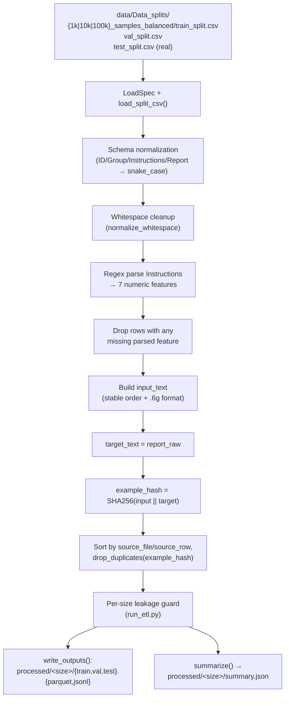

# ETL — `data/Data_splits/*.csv` → canonical `processed/<size>/`

The ETL stage takes the raw CSV splits shipped in `data/Data_splits/` (simulated
train/val + real PD/HC test reports) and turns them into a single, canonical,
deduplicated, leakage‑checked dataset that the training pipeline can consume
without re‑parsing strings.

Code lives in [`etl/`](../etl). Two main entry points:

- `etl/etl_lib.py` — pure library: schema normalization, feature parsing,
  hashing, dedup, summaries, serialization (`load_split_csv`, `write_outputs`,
  `summarize`).
- `etl/run_etl.py` — CLI that runs ETL across the three train sizes
  (`1k`, `10k`, `100k`) and writes a `summary.json` per size with leakage stats.

## High-level flow



## What each step actually does

1. **Load + normalize schema** — `load_split_csv` strips column whitespace,
   ensures a `Group` column exists (synthetic CSVs lack it), and renames to
   `sample_id`, `group`, `instructions_raw`, `report_raw`. It also tags every
   row with `split`, `is_real`, `source_file`, `source_row` for provenance.
2. **Parse the 7 features** — A single regex
   (`(?P<name>...):\s*(?P<value>[-+]?\d+(?:\.\d+)?)`) handles both
   `"Breathing: 78. Lips: 1.75. ..."` and `"Breathing: 53 Lips: 0.89 ..."`
   spacing variants and yields the columns
   `breathing, lips, palate, larynx, monotonicity, tongue, intelligibility`.
   Rows with any missing parsed feature are dropped.
3. **Build canonical text fields** — `input_text` is rebuilt deterministically
   in fixed order with `f"{name}: {val:.6g}"` so two reruns produce
   byte-identical prompts; `target_text` is the (whitespace-normalized) report.
4. **Hash + dedup** — `example_hash = sha256(input_text + "\n\n" + target_text)`
   then a stable sort on `(source_file, source_row)` and
   `drop_duplicates(subset=["example_hash"], keep="first")`.
5. **Leakage guard (run_etl.py only)** — Synthetic splits reuse `ID`, so we
   compare `example_hash` sets across splits and drop val rows that overlap
   train, and test rows that overlap train ∪ val.
6. **Serialize** — `write_outputs` writes Parquet (with CSV fallback if no
   `pyarrow`/`fastparquet`) plus a JSONL with the training-relevant subset of
   columns. `summarize` records row counts, group counts, missing-feature
   counts, and char-length percentiles.

## Canonical row schema

| column | type | notes |
| --- | --- | --- |
| `sample_id` | int / str | original `ID` value |
| `split` | str | `train` \| `val` \| `test` |
| `is_real` | bool | `True` only for `test_split.csv` |
| `group` | str / null | `PD`, `HC`, or `None` for synthetic |
| `instructions_raw` | str | original `Instructions`, whitespace-normalized |
| `report_raw` | str | original `Report`, whitespace-normalized |
| `breathing`…`intelligibility` | float | 7 parsed acoustic features |
| `input_text` | str | canonical prompt (fixed order, `.6g`) |
| `target_text` | str | training target (= `report_raw`) |
| `source_file`, `source_row` | str, int | provenance |
| `example_hash` | str | SHA256 of `input_text + "\n\n" + target_text` |

## Outputs

For each `train_size ∈ {1k, 10k, 100k}` `run_etl.py` writes:

```
processed/<train_size>/
  train.parquet  train.jsonl
  val.parquet    val.jsonl
  test.parquet   test.jsonl
  summary.json
```

`summary.json` records row counts, group counts, missing-feature rows,
input/target char-length stats, and the leakage drop counts.

## Run it

All commands assume PowerShell on Windows and that you start from the repo
root:

```powershell
cd c:\Users\dawoo\PycharmProjects\AcousticDrivenGeneration
```

### 0. One-time environment setup

```powershell
# create the conda env (Python 3.11 recommended)
conda create -n AcousticDrivenGeneration python=3.11 -y
conda activate AcousticDrivenGeneration

# project Python deps (pandas, pyarrow, datasets, transformers, ...)
pip install -r requirements.txt
```

For later sessions just activate the env:

```powershell
conda activate AcousticDrivenGeneration
```

Sanity check that `python` resolves to the env interpreter:

```powershell
python -c "import sys; print(sys.executable)"
# -> ...\envs\AcousticDrivenGeneration\python.exe
```

### 1. Run the ETL

```powershell
# all three train sizes (1k / 10k / 100k)
python etl\run_etl.py

# only a single train size
python etl\run_etl.py --train-size 1k
python etl\run_etl.py --train-size 10k
python etl\run_etl.py --train-size 100k
```

`run_etl.py` accepts `--train-size {all,1k,10k,100k}` (default `all`).
Each invocation prints one line per finished size, e.g.

```
[OK] wrote processed datasets for train_size=1k to ...\processed\1k
```

Outputs land in `processed/<size>/{train,val,test}.{parquet,jsonl}` plus
`processed/<size>/summary.json` (row counts, group counts, leakage drops).

### 2. Optional — reports and figures

The same folder ships auxiliary scripts that consume `processed/`:

```powershell
# Markdown report (tables + figure references)
python etl\generate_etl_report.py            # -> etl\reports\etl_report.md

# PNG dashboards per train size
python etl\make_processed_figures.py --train-size all
# -> processed\<size>\dashboard_report\*.png

# Single PDF report (tables + all dashboards) — uses conda run explicitly
conda run -n AcousticDrivenGeneration python etl\generate_etl_pdf.py
# default output: etl\reports\etl_report.pdf
# custom path:    python etl\generate_etl_pdf.py -o path\to\report.pdf
```

### 3. If `python` is not the conda interpreter

Use `conda run` to be explicit:

```powershell
conda run -n AcousticDrivenGeneration python etl\run_etl.py --train-size 1k
```
