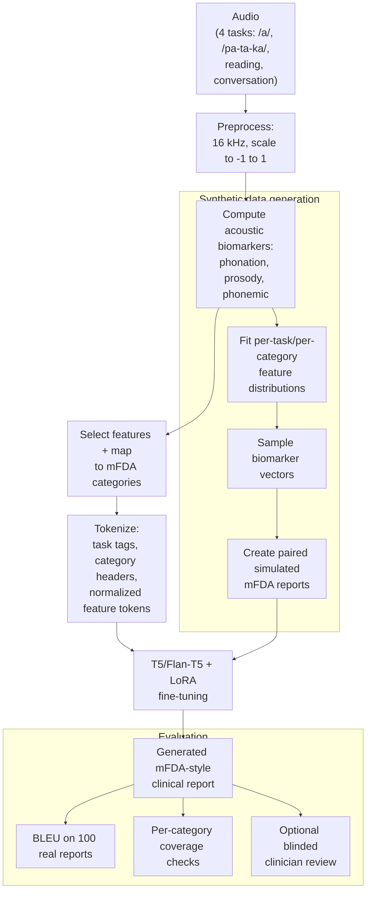

## Proposed Pipeline

Figure: End-to-end pipeline from audio to tokenized biomarker prompts and fine-tuned T5/Flan-T5 outputs, with a synthetic data branch for scalable supervision and evaluation on held-out real reports.

